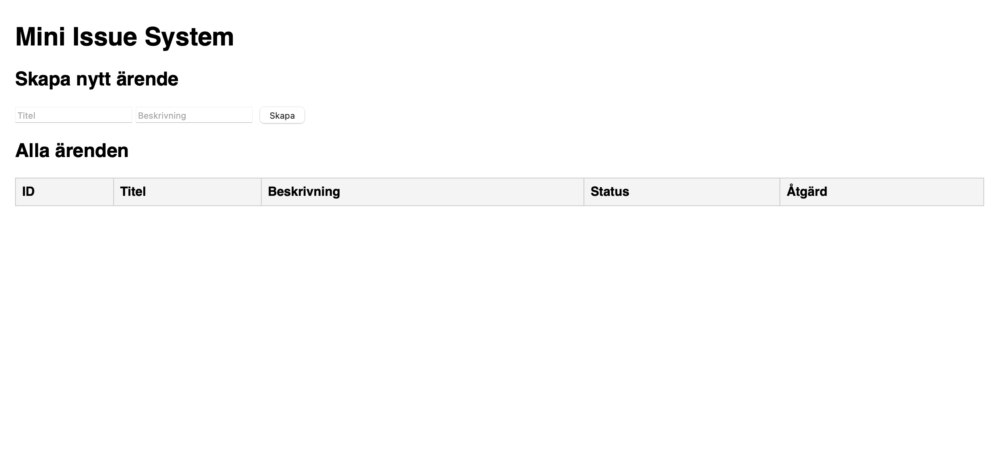
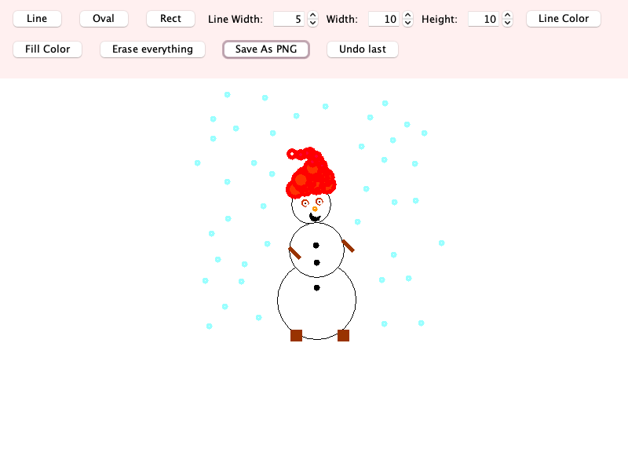
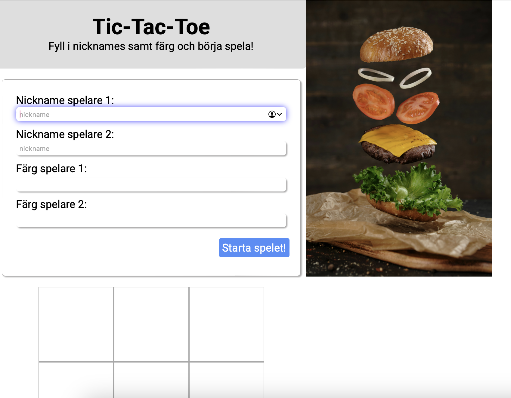
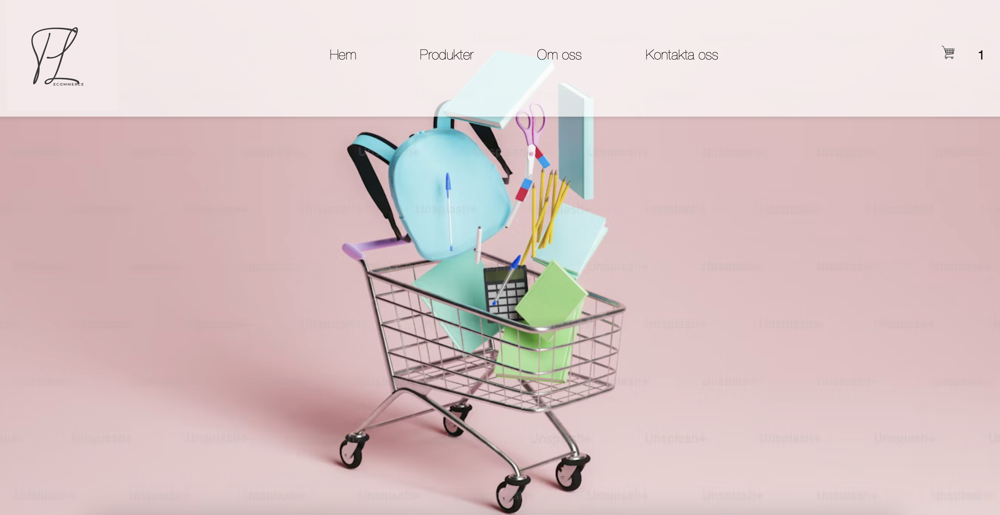

📁 **demo** – Mini Issue System

Ett litet ärendehanteringssystem byggt med Spring Boot och H2-databas. Frontend är enkel HTML/JS som kommunicerar med backend via REST API.

## Funktioner
- Skapa nya ärenden
- Lista alla ärenden
- Stäng ärenden

## Byggt med
- Java 17 + Spring Boot 3.5.5
- Maven
- H2 in-memory database
- HTML / JS

## Beskrivning
Projektet demonstrerar grundläggande REST API-integration, enkel frontend-backend-kommunikation samt användning av in-memory databas för snabba tester.

---

📁 **MVC** – Ritverktyg

Ett ritverktyg byggt med Java och Swing, strukturerat enligt MVC-designmönstret.

## Funktioner
- Rita linjer, ovaler och rektanglar
- Välja linjefärg och fyllningsfärg
- Justera linjebredd, höjd och bredd
- Spara ritningen som PNG
- Radera allt eller ångra senaste ändringar

## Byggt med
- Java 21
- Java Swing
- Maven
- MVC-designmönster
- Facade-mönster

## Beskrivning
Projektet demonstrerar grundläggande användning av Java Swing för GUI-utveckling, tydlig separation av ansvar enligt MVC-designmönstret. Applikationen möjliggör interaktiv ritning av former, färgval och dynamisk hantering av ritobjekt. För att ytterligare strukturera koden används **Facade-mönstret**, vilket ger ett förenklat gränssnitt mot komplexa delar av modellen och bidrar till ökad modularitet och testbarhet.

---

📁 **chatbot** – AI Chatbot

En enkel chatbot byggd med Node.js och Express.js. Frontend (HTML, CSS, JS) hanterar gränssnittet, medan backend kommunicerar med OpenAI:s API för att generera svar. API-nyckeln lagras säkert i en .env-fil.

## Funktioner
- Skicka meddelanden till chatboten
- Ta emot AI-genererade svar via OpenAI API
- Visa dialogen i en chattruta

## Byggt med
- Node.js
- Express.js
- OpenAI API
- JavaScript (ES6+)
- HTML & CSS

## Beskrivning
Projektet demonstrerar hur en chatbot kan implementeras i en Node.js-miljö med Express.js som backend och OpenAI:s API för AI-genererade svar. Användarens meddelanden skickas till OpenAI:s API, som genererar svar och returnerar dessa till frontend-delen. Applikationen möjliggör en interaktiv dialog i en chattruta, där kommunikationen mellan användare och bot sker i realtid. För att säkerställa säker hantering av API-nyckeln används miljövariabler via .env, vilket underlättar både vidareutveckling och driftsättning.

----

📁 **game-ttt** – Tic-tac-toe

Ett Tic Tac Toe-spel byggt helt som frontend med HTML, CSS och JavaScript.

## Funktioner
- Ange namn och färg för två spelare
- Växla tur mellan spelare automatiskt
- Kontrollera vinster, oavgjort och avsluta spelet korrekt
- Valfri timer som begränsar tiden per drag
- Återställ spelet för att spela igen
- Responsiv layout som fungerar på både mobil, surfplatta och desktop

## Byggt med
- HTML för spelplan och formulär
- CSS för layout, färger och stilar
- JavaScript för spel-logik, turhantering och timer

## Beskrivning
Projektet demonstrerar hur ett interaktivt spel kan implementeras helt i frontend. Speldata lagras i ett globalt objekt (oGameData), vilket gör det enkelt att hålla koll på spelplan, spelare och aktuell tur. Timer-funktionen visar hur man kan kombinera DOM-manipulation med asynkron logik, och spelets modulära uppbyggnad underlättar vidareutveckling, t.ex. fler spelregler eller AI-motståndare. Den responsiva designen säkerställer att spelet fungerar smidigt på olika enheter och skärmstorlekar.

----

📁 **Ecommerce** – Enkel e-handel

En enkel e-handel byggd helt i frontend med HTML, CSS och JavaScript. Användaren kan se produkter, lägga till dem i en varukorg och se totalpris och antal artiklar i varukorgen.

## Funktioner
- Visa lista över produkter med bild, namn och pris
- Lägg produkter i varukorgen
- Visa antal produkter och totalpris i varukorgen
- Visa och dölja varukorgen med knapp
- All logik hanteras i frontend med JavaScript

## Byggt med
- HTML för layout och struktur
- CSS för design och stil
-JavaScript för produktlogik och varukorgshantering

## Beskrivning
Projektet demonstrerar hur man kan bygga en enkel webbutik utan backend. Produktdata lagras i en JavaScript-array och varukorgens innehåll uppdateras dynamiskt i DOM:en. Designen är modulär och gör det enkelt att lägga till fler produkter eller funktioner, exempelvis filtrering eller sortering.

---

# Resultat från Analys
## Use case diagram

## Sekvensdiagram för 📁analys
### Skapa Fil (Analys)

### Öppna Fil (Analys)

### Spara Fil (Analys)

### Ändra Fil (Analys)

### Skriva Text (Analys)

### Klippa Ut Text (Analys)

### Kopiera Text (Analys)

### Klistra in Text (Analys)

### Spara Fil Som (Analys)

### Stäng Fil (Analys)

# Resultat från 📁design
## Klassdiagram för Design

  
## Sekvensdiagram för Design

**💡 Förklaring av metoder mellan :FileManager ---> :File:** 
###### new File() – Skapar en ny fil. 
###### readFile() – Läser in filen.
###### readText() – Hämtar textinnehållet från en fil.
###### getContent() - Hämtar det innehåll som ska klistras in vid pasteText()
###### getContent() - Sätter det innehållet som getContent() hämtat.
###### setFileName() och getFileName() – Hanterar filens namn.

### Skapa Fil (Design)

### Öppna Fil (Design)

### Spara Fil (Design)

### Ändra Fil (Design)

### Skriva Text (Design)

### Klippa Ut Text (Design)

### Kopiera Text (Design)

### Klistra In Text (Design)

### Spara Fil Som (Design)

### Stäng fil (Design)

